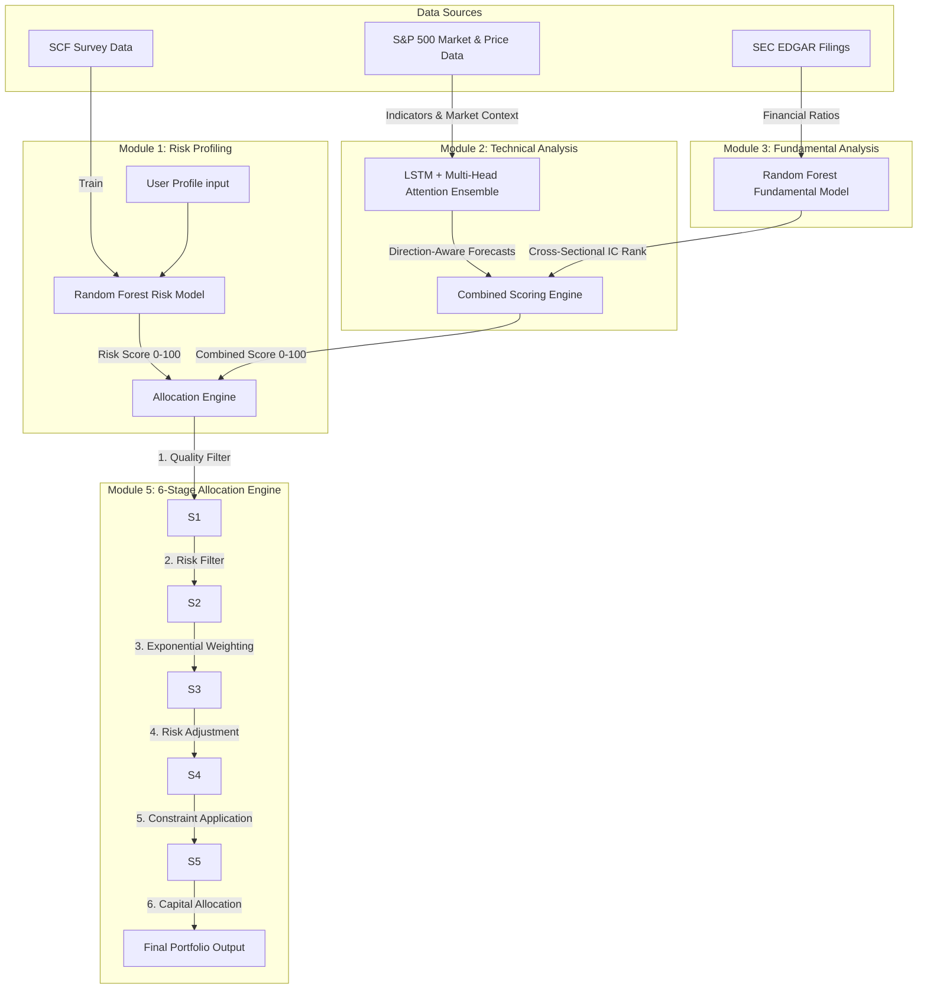
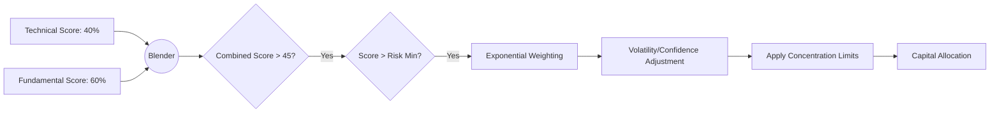

# Unified Robo-Advisory System: A Deep Learning and Multi-Factor Approach to Automated Wealth Management

## Abstract
This document outlines the architecture, methodology, and implementation details of the Unified Robo-Advisory System. Built on a hybrid framework, the system integrates deep learning for technical analysis, ensemble machine learning for fundamental analysis, and demographic-driven risk profiling. Together, these modules feed into a 6-stage capital allocation engine. This architecture ensures risk-adjusted, high-conviction portfolio generation capable of adapting to live market conditions via an automated retraining pipeline.

---

## 1. Introduction
The Robo-Advisory System is designed to automate the portfolio management lifecycle. It bridges the gap between quantitative factor investing and modern deep learning. The system evaluates a universe of S&P 500 blue-chip stocks by ingesting parallel streams of technical price/volume data and fundamental SEC EDGAR filings. 

The core novelty lies in its **Unified Scoring Engine**, which optimally blends short-to-medium-term technical signals with long-term fundamental quality, and its **6-Stage Allocation Engine** that mathematically maps an investor's empirical risk tolerance to precise capital weights.

---

## 2. System Architecture & Data Flow



---

## 3. Methodology

### 3.1. Risk Tolerance Prediction (Module 1)
To prevent subjective risk misalignment, the system utilizes an empirical model derived from the **Survey of Consumer Finances (SCF)**.
- **Model:** Random Forest Regressor.
- **Features:** 19 demographic and financial variables (e.g., Age, Education, Income percentages, Net worth percentiles).
- **Output:** A continuous risk score [0, 100], mapped to discrete categories ranging from *Ultra Conservative* to *Ultra Aggressive*. This score strictly defines the maximum equity exposure and concentration limits.

### 3.2. Technical Analysis Model (Module 2)
The technical module focuses on price action, momentum, and mean-reversion characteristics over a 15-year historical window.
- **Feature Engineering:** 15 localized and market-contextual features are generated. These include enhanced indicators (RSI, ADX, NATR, MACD, Bollinger position) and market metrics (S&P 500 relative strength, beta, market volatility).
- **Architecture:** 
  - **Inputs:** Sequences of length 60 ($t-60$ to $t$).
  - **Layers:** A 256-unit LSTM layer feeds into an 8-head **Multi-Head Attention** mechanism with layer normalization and residual connections. This is followed by a 128-unit LSTM and dense projection layers.
  - **Ensemble:** 5 distinct models are trained using different random seeds. Predictions are variance-weighted to form a stable consensus.
- **Direction-Aware Loss:** A custom loss function (`DirectionAwareLoss`) is utilized to heavily penalize predictions where the model forecasts the wrong direction (sign) of the return, optimizing for directional accuracy over pure MSE.

### 3.3. Fundamental Analysis Model (Module 3)
The fundamental module evaluates company health, valuation, and growth to capture long-term alpha.
- **Feature Engineering:** Derives log-transformed revenue growth, quality composites, and Piotroski-style profitability signals.
- **Architecture:** A `RandomForestRegressor` operating on financial ratios.
- **Scoring Pipeline:** Instead of outputting absolute returns, raw predictions are cross-sectionally rank-normalized dynamically. This converts absolute forecasts into a percentile score [0, 100], allowing standard factor-investing evaluation (Valuation Information Coefficient, or Val IC).

---

## 4. Unified Portfolio Generation



### 4.1. Combined Scoring Engine (Module 4)
The engine integrates the models into a singular conviction score using a weighted sum:
- **60% Weight:** Fundamental Analysis (high stability, long-term).
- **40% Weight:** Technical Analysis (momentum, short-term entries).
*Note: Stocks missing fundamental data are penalized recursively.*

### 4.2. 6-Stage Allocation Pipeline (Module 5)
Capital dynamically flows through six rigorous stages:
1. **Quality Filtering:** Rejects any asset with a combined score < 45 or a negative/sell signal.
2. **Risk-Based Selection:** Dynamically raises the minimum score threshold based on the user's risk profile (Conservative requires a minimum score of 60; Aggressive requires 45).
3. **Weighting:** Applies an exponential transformation ($\gamma = 2.0$) to combined scores, heavily rewarding top-decile assets.
4. **Risk Adjustment:** Weights are penalized based on prediction uncertainty ($\sigma$ of the technical ensemble) and adjusted based on indicator confidence (e.g., ADX trend strength).
5. **Constraint Application:** Implements maximum concentration limits (e.g., max 10% per stock for conservative profiles). Distributes excess weight iteratively.
6. **Capital Allocation:** Final weights are multiplied by the risk-adjusted maximum equity allowance, shifting the remainder to a cash reserve.

---

## 5. Model Training and Lifecycle

The system is built for autonomous live deployment. The `retrain.py` pipeline manages the lifecycle of all models:

- **Incremental Fine-Tuning:** The technical LSTM ensemble can undergo fast, incremental fine-tuning on the latest 2 years of market data. It uses a reduced learning rate ($1e-4$) and Early Stopping to adapt to recent market regimes without catastrophic forgetting.
- **Full Retraining:** Both the Fundamental (RF) and Technical (LSTM) models can be trained from scratch. 
- **Versioning:** Models are stamped with timestamped version tags (e.g., `tech_v20260310_120530`) and saved to MongoDB. The Unified Generator automatically fetches the best performing versions at inference time.

---

## 6. Usage & Execution

### Generating a Portfolio
Run the unified pipeline from the master script:
```bash
# Default moderate profile
python main.py

# Aggressive profile with custom capital
python main.py --profile aggressive --capital 150000

# Compare all profiles side-by-side
python main.py --compare
```

### Retraining Models on Live Data
Maintain model relevance by executing the retraining daemon:
```bash
# Fast incremental update for technical models
python retrain.py --model technical --mode incremental

# Full system retraining from scratch
python retrain.py --model all --mode full
```

### Dashboard Interface
For interactive usage, the system provides a headless Streamlit GUI:
```bash
streamlit run app.py
```
